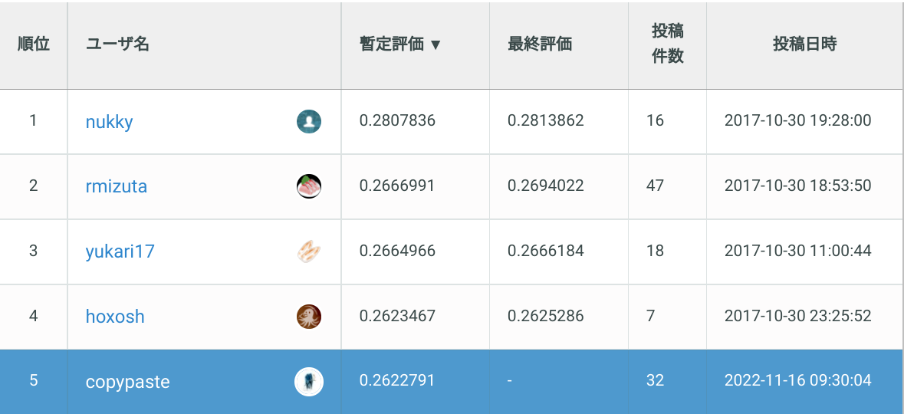

# SIGNATE SOTA Challenge
This is the code for the SIGNATE recommendation competition. (Click [here](https://signate.jp/competitions/268) for the competition page.) I entered the [SOTA Challenge](https://signate.jp/features/state-of-the-art-challenge), not the original competition. The rankings written in this repository will be the results around November 2022.



## Solution

The solution uses Retriever(Recaller) + Ranker, which is commonly used in recommendation competitions. (like [kaggle H&M](https://www.kaggle.com/competitions/h-and-m-personalized-fashion-recommendations/overview))
I think that the originality of my solution is the retriever and the feature using [RecBole](https://recbole.io/) (efficient recommendation library). By using RecBole, I was able to reproduce 5th place public LB score with only 40 features. I think we can aim for a higher score by adding basic features using TimeStamp, which is explained in the [1st place solution](https://www.slideshare.net/ShunNukui/ss-94997937). The reason I participated in this competition was because I wanted to use RecBole, so I didn't focus on mass production of features. Participating in this competition made me realize that RecBole is a very easy-to-use and powerful tool.


Also, at the beginning of the competition, CV was calculated using a dataset1 with a feature generation period of 2 weeks. (CV and LB were strongly correlated.) However, in the final submission, the model was trained with a feature generation period of 3 weeks (dataset2). This improved LB about +0.01.


## Setup

Connect to the docker container environment with the following command.
```
$ docker compose up -d
$ docker exec -it opt-sota-challenge /bin/bash
```

And install [RecBole](https://recbole.io/) (efficient recommendation library).
```
$ cd RecBole
$ pip install -e . --verbose
```

If you get an error when importing cudf or torch, the following commands may help. It seems that tensorboard installed with Recbole may conflict with cudf and torch.
```
$ pip install protobuf==3.20
$ export LD_LIBRARY_PATH=$LD_LIBRARY_PATH:/opt/conda/envs/rapids/lib
```

## Execution

The final submit can be roughly reproduced with the following command. The actual final submission is a single model (catboost) without ensemble.
```
$ sh run.sh
```